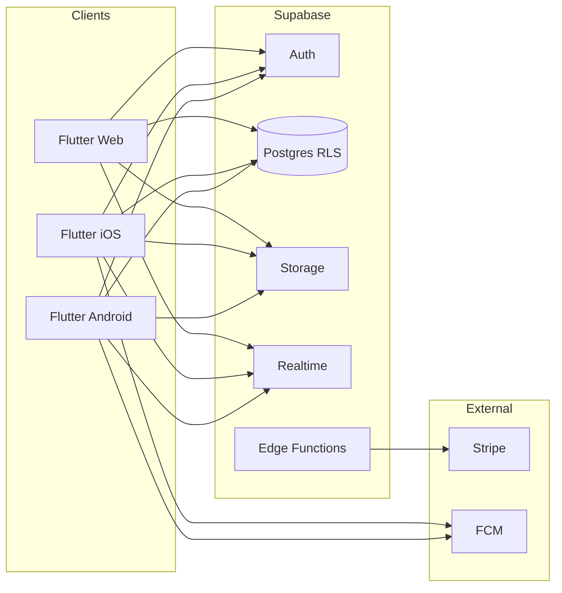

# Integrations and Development Setup (MVP)

This document inventories third-party services, Flutter packages, and developer tooling for the **School Management SaaS MVP** (Flutter Web, iOS, Android; Supabase backend; multi-tenant isolation). It also provides a **from-scratch environment setup** for new developers.

**Related project context:** see `product.md`, `rules.md`, and `branding.md`.

**Tool inventory, MCP notes, and environment blockers:** see [DEV_TOOLING_AND_ONBOARDING.md](DEV_TOOLING_AND_ONBOARDING.md).

---

## Table of contents

1. [Executive summary](#1-executive-summary)
2. [Architecture overview](#2-architecture-overview)
3. [Backend and platform services](#3-backend-and-platform-services)
4. [Payments](#4-payments)
5. [Messaging and notifications](#5-messaging-and-notifications)
6. [Optional analytics and monitoring](#6-optional-analytics-and-monitoring)
7. [Flutter packages (MVP)](#7-flutter-packages-mvp)
8. [Developer tools (local and CI)](#8-developer-tools-local-and-ci)
9. [Step-by-step: new development environment](#9-step-by-step-new-development-environment)
10. [CI/CD suggestions](#10-cicd-suggestions)
11. [Tips and caveats](#11-tips-and-caveats)

---

## 1. Executive summary

| Layer | MVP choice | Role |
|--------|------------|------|
| Client | Flutter (Web, iOS, Android) | Single codebase; mobile-first UX |
| State | Riverpod | Per project rules |
| Backend | Supabase | Auth, Postgres (RLS), Storage, Realtime, Edge Functions |
| Payments | Stripe | School subscriptions; optional fee collection |
| Push | Firebase Cloud Messaging (FCM) | Standard Flutter path for iOS/Android |
| In-app messaging | Supabase Realtime (+ Postgres) | Threads/messages; presence optional later |
| Optional | Sentry, PostHog or Firebase Analytics | Errors and product analytics (MVP-optional) |

No application code lives in this document—only preparation and integration guidance.

---

## 2. Architecture overview

**Multi-tenancy (MVP):** enforce isolation with **Row Level Security (RLS)** on Postgres, keyed by `school_id` (or equivalent) derived from the authenticated user’s membership. JWT custom claims or a `profiles` / `school_users` join table are common patterns—design in schema work, not in this doc.

---

## 3. Backend and platform services

### 3.1 Supabase (required)

| Capability | Purpose |
|------------|---------|
| **Auth** | Email/password, magic links, OAuth providers as needed; JWT for API access |
| **Postgres** | All app data; **RLS** for tenant isolation |
| **Storage** | Documents, exports, optional attachments |
| **Realtime** | Live updates for messaging and optionally attendance/grades lists |
| **Edge Functions** | Stripe webhooks, subscription sync, server-side secrets |

**Why:** Matches product requirement (Supabase backend) and rules (auth, DB, storage in one place).

**Installation (CLI — for local tooling and deployments):**

1. Install [Supabase CLI](https://supabase.com/docs/guides/cli) (pick one):
   - **Homebrew (macOS):** `brew install supabase/tap/supabase`
   - **npm:** `npm install -g supabase`
2. Verify: `supabase --version`

**Project setup (dashboard):**

1. Create a project at [supabase.com](https://supabase.com).
2. Note **Project URL**, **anon public key**, and **service_role** key (server/Edge Functions only—never ship `service_role` in the Flutter app).

**App configuration (Flutter):**

1. Add the client package (see [§7](#7-flutter-packages-mvp)): `flutter pub add supabase_flutter`
2. Initialize after `WidgetsFlutterBinding.ensureInitialized()` with URL and anon key (from environment—see [§9.8](#98-secrets-and-environment-variables)).

**Local development (optional but recommended):**

1. In repo: `supabase init` (once) to create `supabase/` config.
2. `supabase start` for local Postgres and services (Docker required).
3. Link to remote: `supabase link --project-ref <ref>` for migrations.

**Tips / caveats:**

- **Always test RLS** with real JWT roles; the service role bypasses RLS—use only in Edge Functions or trusted backends.
- Prefer **migrations** in source control over manual dashboard-only schema changes.

---

## 4. Payments

### 4.1 Stripe (recommended for MVP)

| Use case | MVP scope |
|----------|-----------|
| **B2B subscription** | Schools pay monthly—Stripe Billing (Checkout or Customer Portal) |
| **Fee collection** | Optional: Payment Intents or Checkout for parent-paid fees |

**Why:** De facto standard; strong docs; works with webhooks for subscription state.

**Installation (dashboard + keys):**

1. Create a [Stripe](https://stripe.com) account; use **Test mode** for development.
2. Dashboard → Developers → **API keys**: publishable key (client-safe for some flows) and **secret key** (server/Edge Functions only).

**Integration pattern (MVP):**

1. Flutter initiates Checkout or Billing Portal via **Edge Function** or lightweight backend (secret key never in the app binary).
2. Stripe sends **webhooks** (e.g. `customer.subscription.updated`) to a **Supabase Edge Function** URL.
3. Edge Function verifies signature with `STRIPE_WEBHOOK_SECRET`, updates `schools` / `subscriptions` tables.

**Flutter packages:** see [§7.5](#75-payments-and-billing-related).

**Tips / caveats:**

- Use **Stripe test clocks** for subscription lifecycle testing.
- **Web:** 3-D Secure and redirect flows differ from mobile; test in Stripe’s test cards.
- **Apple/Google IAP** for digital goods inside mobile apps follow different rules than school B2B web billing—clarify business model with legal/product before shipping mobile-specific purchase flows.

---

## 5. Messaging and notifications

### 5.1 In-app messaging (required for product “Messaging”)

| Approach | MVP |
|----------|-----|
| **Supabase Realtime** | Subscribe to Postgres changes or broadcast channels for threads/messages |
| **Polling** | Acceptable early MVP fallback; worse UX and higher load |

**Why:** Keeps data in your Postgres model; RLS applies when clients use the anon key with user JWT.

**Configuration:** Enable Realtime on relevant tables in Supabase; ensure RLS policies allow `select`/`insert` as intended per role (parent/teacher/admin).

### 5.2 Push notifications (iOS / Android)

| Service | Purpose |
|---------|---------|
| **Firebase Cloud Messaging (FCM)** | Push tokens; works with Flutter |

**Why:** Flutter’s well-trodden path; APNs on iOS is handled via FCM when configured correctly.

**Installation (high level):**

1. Create a **Firebase** project at [console.firebase.google.com](https://console.firebase.google.com).
2. Add **iOS** and **Android** apps; download `GoogleService-Info.plist` (iOS) and `google-services.json` (Android).
3. FlutterFire: `dart pub global activate flutterfire_cli` then `flutterfire configure` (select platforms and Firebase project).

**Flutter packages:** `firebase_core`, `firebase_messaging`; optionally `flutter_local_notifications` for foreground display.

**Tips / caveats:**

- **iOS:** Enable Push Notifications capability in Xcode; upload APNs key to Firebase.
- **Android:** Default FCM setup; handle notification channels on modern Android.
- **Web push** uses a different mechanism (VAPID, service worker)—scope separately if MVP includes web push.

---

## 6. Optional analytics and monitoring

| Tool | Purpose | MVP? |
|------|---------|------|
| **Sentry** (`sentry_flutter`) | Crash and error reporting, performance traces | Optional; highly useful pre-launch |
| **PostHog** or **Firebase Analytics** | Product analytics, funnels | Optional |

**Installation (Sentry example):**

1. Create project on [sentry.io](https://sentry.io); copy DSN.
2. `flutter pub add sentry_flutter`
3. Initialize in `main()` with DSN from environment; enable native crash reporting per docs.

**Tips:** Keep PII out of analytics payloads; align with school data policies.

---

## 7. Flutter packages (MVP)

Below: **purpose**, **install**, **configuration** at a high level. Adjust versions to current stable on [pub.dev](https://pub.dev).

### 7.1 Core app and backend

| Package | Purpose | Install | Configuration |
|---------|---------|---------|---------------|
| `supabase_flutter` | Supabase client (auth, DB, storage, realtime) | `flutter pub add supabase_flutter` | URL + anon key at init |
| `flutter_riverpod` | State management (required per rules) | `flutter pub add flutter_riverpod` | Wrap app with `ProviderScope` |
| `riverpod_annotation` + `riverpod_generator` (optional) | Typed providers, codegen | `flutter pub add riverpod_annotation dev:riverpod_generator dev:build_runner` | Run `dart run build_runner build` |
| `go_router` | Declarative routing (web deep links, auth guards) | `flutter pub add go_router` | Define routes; integrate with auth state |

### 7.2 Models and serialization

| Package | Purpose | Install | Configuration |
|---------|---------|---------|---------------|
| `freezed` + `json_serializable` | Immutable models, JSON | `flutter pub add freezed_annotation json_annotation; flutter pub add dev:freezed dev:json_serializable dev:build_runner` | `build_runner` for `.freezed.dart` / `.g.dart` |
| `equatable` (alternative) | Value equality | `flutter pub add equatable` | Lightweight alternative to Freezed if codegen is deferred |

**Tip:** Project rules require models for DB tables—codegen reduces drift.

### 7.3 Forms and validation

| Package | Purpose | Install | Configuration |
|---------|---------|---------|---------------|
| `reactive_forms` or `flutter_form_builder` | Structured forms | e.g. `flutter pub add reactive_forms` | Match validation to server rules |
| Built-in `RegExp` / small validators | Simple rules | — | Keep validators testable |

### 7.4 UI, layout, assets

| Package | Purpose | Install | Configuration |
|---------|---------|---------|---------------|
| `google_fonts` | Manrope / Inter (see branding) | `flutter pub add google_fonts` | Use `TextTheme` / `ThemeData` |
| `flutter_svg` | SVG assets | `flutter pub add flutter_svg` | — |
| `cached_network_image` | Cached images | `flutter pub add cached_network_image` | — |
| `intl` | Dates, numbers, formatting | `flutter pub add intl` | Set `locale` / `localizationsDelegates` if i18n later |

### 7.5 Payments and billing-related

| Package | Purpose | Install | Configuration |
|---------|---------|---------|---------------|
| `url_launcher` | Open Stripe Checkout / Portal in browser | `flutter pub add url_launcher` | Platform-specific setup per docs |
| `webview_flutter` or `flutter_inappwebview` | Optional embedded flows | Add if product requires in-app web | — |

**Note:** Prefer **hosted Checkout / Portal** via Edge Function URLs for MVP to minimize PCI scope; avoid embedding card fields in-app unless required.

### 7.6 Charts (grades / simple dashboards)

| Package | Purpose | Install | Configuration |
|---------|---------|---------|---------------|
| `fl_chart` | Simple charts for grades/trends | `flutter pub add fl_chart` | Theming to match branding |

### 7.7 Utilities

| Package | Purpose | Install | Configuration |
|---------|---------|---------|---------------|
| `flutter_dotenv` | Load `.env` in dev (optional) | `flutter pub add flutter_dotenv` | Or use `--dart-define` only |
| `uuid` | Client-generated IDs if needed | `flutter pub add uuid` | — |
| `path` / `path_provider` | Paths and app dirs | `flutter pub add path path_provider` | — |
| `file_picker` | Uploads to Storage | `flutter pub add file_picker` | Platform permissions |

### 7.8 Firebase (push)

| Package | Purpose | Install | Configuration |
|---------|---------|---------|---------------|
| `firebase_core` | Firebase init | `flutter pub add firebase_core` | FlutterFire configure |
| `firebase_messaging` | FCM | `flutter pub add firebase_messaging` | iOS/Android setup |
| `flutter_local_notifications` | Show notifications in foreground | `flutter pub add flutter_local_notifications` | — |

### 7.9 Optional monitoring

| Package | Purpose | Install | Configuration |
|---------|---------|---------|---------------|
| `sentry_flutter` | Error tracking | `flutter pub add sentry_flutter` | DSN from env |

### 7.10 Testing and quality

| Package | Purpose | Install | Configuration |
|---------|---------|---------|---------------|
| `flutter_test` (SDK) | Unit/widget tests | Built-in | — |
| `integration_test` (SDK) | E2E | Built-in | — |
| `mocktail` | Mocks | `flutter pub add dev:mocktail` | — |
| `very_good_analysis` or `flutter_lints` | Lints | `flutter pub add dev:flutter_lints` | `analysis_options.yaml` |

---

## 8. Developer tools (local and CI)

| Tool | Purpose |
|------|---------|
| **Git** | Version control |
| **Flutter SDK (stable)** | Dev and builds |
| **Xcode** (macOS) | iOS builds, Simulator, signing |
| **Android Studio / Android SDK** | Android builds, Emulator |
| **CocoaPods** (`pod`) | iOS native dependencies |
| **Chrome** | Flutter web debug |
| **Docker** (optional) | Local Supabase (`supabase start`) |
| **Supabase CLI** | Migrations, link, functions |
| **Stripe CLI** (optional) | Forward webhooks to local Edge Function |
| **Node.js** (optional) | Stripe CLI, some tooling |

---

## 9. Step-by-step: new development environment

### 9.1 Operating system

- **macOS** is recommended for **iOS + Android + Web** in one machine.
- **Windows/Linux** can target Android and Web; iOS builds require macOS + Xcode.

### 9.2 Install Git

1. Install Xcode Command Line Tools (includes git on macOS): `xcode-select --install`
2. Configure identity: `git config --global user.name "..."` and `user.email`

### 9.3 Install Flutter

1. Download Flutter SDK from [flutter.dev](https://docs.flutter.dev/get-started/install) or use Homebrew: `brew install --cask flutter`
2. Add `flutter` to `PATH` (follow official docs for your shell).
3. Run `flutter doctor -v` and resolve issues (Android toolchain, Xcode, Chrome).

### 9.4 Android setup

1. Install **Android Studio**; install **Android SDK**, **SDK Platform**, and **build-tools** via SDK Manager.
2. Accept licenses: `flutter doctor --android-licenses`
3. Create an Android Virtual Device (AVD) if using emulator.

### 9.5 iOS setup (macOS only)

1. Install **Xcode** from App Store.
2. `sudo xcodebuild -license accept`
3. Open Xcode once; install additional components.
4. `sudo gem install cocoapods` or `brew install cocoapods`
5. For physical device: Apple Developer account, signing in Xcode.

### 9.6 Web

1. Ensure **Chrome** installed.
2. `flutter config --enable-web`
3. Run: `flutter run -d chrome`

### 9.7 Supabase

1. Create Supabase project (see [§3](#3-backend-and-platform-services)).
2. Install Supabase CLI; optionally run `supabase start` locally with Docker.
3. Store **anon** key and URL for the Flutter app (never commit production secrets to public repos).

### 9.8 Secrets and environment variables

**Recommended patterns:**

- **CI / release:** `--dart-define=SUPABASE_URL=...` and `--dart-define=SUPABASE_ANON_KEY=...` (and similar for Sentry DSN if used).
- **Local dev:** same via a small shell script, or `flutter_dotenv` with `.env` in `.gitignore`.

**Never commit:** `service_role` key, Stripe secret key, webhook signing secrets, or production OAuth secrets.

### 9.9 Stripe

1. Use Test mode keys in development.
2. Optionally install **Stripe CLI**: `brew install stripe/stripe-cli/stripe`
3. Login: `stripe login`; forward webhooks: `stripe listen --forward-to <local-or-ngrok-edge-function-url>`

### 9.10 Firebase (FCM)

1. Create Firebase project; register iOS/Android apps.
2. Run `flutterfire configure` from the Flutter project root.
3. Place config files in `ios/` and `android/` per FlutterFire output.
4. Complete iOS push steps (capabilities, APNs key in Firebase).

### 9.11 Clone repo and first run

1. `git clone <repo-url> && cd <repo>`
2. `flutter pub get`
3. If codegen: `dart run build_runner build --delete-conflicting-outputs`
4. `flutter run` with device choice (`-d chrome`, `-d ios`, `-d android`)

---

## 10. CI/CD suggestions

### 10.1 GitHub Actions (minimal MVP pipeline)

Suggested jobs:

1. **analyze** — `flutter analyze` (and `dart format --set-exit-if-changed .` if team agrees).
2. **test** — `flutter test`.
3. **build_web** — `flutter build web --release` with `--dart-define` from GitHub **Secrets**.

Store in GitHub Secrets: `SUPABASE_URL`, `SUPABASE_ANON_KEY`, optional `SENTRY_DSN`, **no** service_role or Stripe secrets in client build unless strictly required (prefer build-time public keys only).

### 10.2 Mobile release (later or parallel)

- **Codemagic**, **Bitrise**, or **GitHub Actions** + **Fastlane** for iOS/Android store uploads.
- **TestFlight** / **Internal testing** tracks for staged rollout.

### 10.3 Supabase migrations

- Run migration deploy from CI on merge to `main` (e.g. `supabase db push`) with **database password** in CI secrets—or apply manually in small teams for MVP.

---

## 11. Tips and caveats

| Topic | Guidance |
|-------|----------|
| **RLS** | Every table with tenant data must have policies; test as parent/teacher/admin roles. |
| **JWT / tenant** | Prefer explicit `school_id` on membership; avoid trusting client-supplied tenant IDs without DB checks. |
| **Stripe + Edge Functions** | Verify webhook signatures; use idempotency for subscription updates. |
| **File size / rules** | Keep feature files under ~300 lines per project rules—split by UI / controller / repository. |
| **Web performance** | First load matters for schools; defer heavy charts; profile with Flutter DevTools. |
| **Accessibility** | Large touch targets per branding; test with system font scaling. |
| **Compliance** | Student data may fall under FERPA/GDPR depending on region—legal review before production. |

---

## Document maintenance

When the stack changes (e.g. adding email provider, SMS, or LMS integrations), update this file and `product.md` together so onboarding stays accurate.
