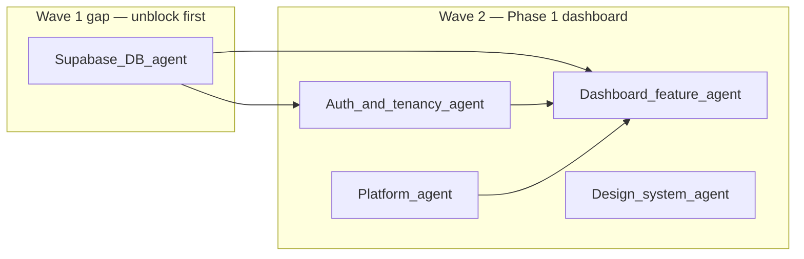

# Wave 2 orchestration — Lead Engineer delegation

**Status:** **Completed** (Wave 2 — Phase 1 dashboard — shipped).  
**Lead decisions (historical):** (1) **Supabase baseline migration must merge before** Phase 1 dashboard work that touches real data. (2) **Single-file ownership:** only the **Supabase / DB** agent edits `supabase/migrations/001_baseline.sql` until merged. (3) **Auth & tenancy** consumes the schema contract; **Platform** does not touch migrations.

**Current work:** [wave3_delegation.md](wave3_delegation.md).

**Authoritative context:** [team_task_board.md](team_task_board.md), [system_design.md](system_design.md), [INTEGRATIONS_AND_SETUP.md](INTEGRATIONS_AND_SETUP.md).

---

## Dependency graph

---

## Agent 1 — Supabase / DB (owner: migration `001_baseline`)

**Priority:** P0 — do this first; everything else depends on it.

**Scope:** Create **[`supabase/migrations/001_baseline.sql`](../supabase/migrations/001_baseline.sql)** (new file; create `supabase/migrations/` if missing).

**Required contents:**

| Object | Spec |
|--------|------|
| `schools` | `id uuid` PK, `name text`, `created_at timestamptz` |
| `profiles` | `id uuid` PK references `auth.users`, `display_name text`, `avatar_url text`, `created_at timestamptz` |
| `school_members` | `id uuid` PK, `school_id` FK → `schools`, `user_id` FK → `profiles`, `role text` CHECK `IN ('admin','teacher','parent')`, `created_at timestamptz` |
| RLS | Enabled on **all three** tables |
| Policies | Users may **read** (and scope writes as needed for MVP) only in line with tenant isolation: rows tied to a **school** are visible only when `school_id` matches a school the caller belongs to via `school_members`. `profiles` need policies consistent with that (at minimum: users manage **own** profile; optional same-school reads for directory in a follow-up). |
| Function | `get_my_school_id()` — returns one `school_id` for the caller (deterministic: oldest membership; add explicit “active school” later if multi-school is first-class). |
| RPC (bootstrap) | `create_school_with_admin(school_name text)` — **SECURITY DEFINER**; creates `schools` row + `school_members` admin row atomically when the user has a **profile**, **no** existing membership, and non-empty name. Avoids insecure open INSERT policies. |

**Out of scope for this file:** Flutter code, seed data (optional separate `seed.sql` later), student/attendance tables (later migrations).

**Acceptance:**

- [ ] Migration applies cleanly on a fresh Supabase project (`supabase db reset` or dashboard SQL).
- [ ] RLS on: `schools`, `profiles`, `school_members`.
- [ ] No `service_role` assumptions in client-facing policies; use `auth.uid()` / membership checks.

**Handoff:** Post the final column list + function signature + policy intent in the PR description so **Auth & tenancy** can wire repositories.

---

## Agent 2 — Auth & tenancy (blocked until Agent 1 merges)

**Priority:** P0 after baseline exists.

**Scope:**

- Align `school_id` / `role` providers and repositories with **`school_members`** (and `profiles`) shape.
- Define how **active school** is chosen if `get_my_school_id()` or multiple memberships apply (stub single-school MVP if needed).
- Ensure **no query** runs without tenant context when touching tenant tables.

**Files (indicative — adjust to repo):** `schoolify_app/lib/core/auth/**`, `schoolify_app/lib/core/tenancy/**`, repository interfaces.

**Acceptance:**

- [ ] After login, app can resolve `role` + at least one `school_id` from membership (or clear “no school” state).
- [ ] Route guards still match [product.md](product.md) roles.

---

## Agent 3 — Platform / Flutter (parallel with Agent 1 only where safe)

**Priority:** P1.

**Scope:**

- Ensure Supabase local/CI expectations are documented (optional `supabase/config.toml` if team uses CLI).
- **Do not** edit `001_baseline.sql`.
- **Do not** parallel-edit `pubspec.yaml` / `main.dart` with unrelated features without sync.

**Acceptance:**

- [ ] [INTEGRATIONS_AND_SETUP.md](INTEGRATIONS_AND_SETUP.md) or [schoolify_app/README.md](../schoolify_app/README.md) mentions applying migrations and anon key usage.

---

## Agent 4 — Design system (parallel)

**Priority:** P2 unless dashboard needs new primitives.

**Scope:**

- Dashboard should reuse existing tokens/widgets ([design_system.md](design_system.md)); only add components if Phase 1 shell gaps exist.

**Acceptance:**

- [ ] No duplicate theme; [branding.md](branding.md) remains source of truth.

---

## Agent 5 — Feature: Dashboard (Wave 2 core — blocked until Auth handoff)

**Priority:** P1 after Agents 1–2.

**Scope:**

- Phase 1 **dashboard**: shell + KPI/schedule **placeholders**; Stitch for layout reference only.
- Prefer **one real read** (e.g. school name from `schools`) only when Auth + RLS path is verified.

**Acceptance:**

- [ ] Responsive shell; mock or one real read per [team_task_board.md](team_task_board.md) Wave 2.

---

## Agent 6 — Stitch / UX (optional)

**Priority:** P3.

**Scope:** Layout alignment pass vs `Stitch UI/` — no export code pasted into production.

---

## Parallelization rules (Lead)

| OK in parallel | Not OK |
|----------------|--------|
| Agent 1 (DB) while Agent 4 (design) reviews widgets | Two agents editing **same** migration file |
| Agent 3 docs while Agent 1 writes SQL | Agent 2 (Auth) **before** baseline schema is finalized |

---

## Review checklist (any PR touching this wave)

- [ ] Matches [system_design.md](system_design.md) — `school_id` tenancy, RLS.
- [ ] [INTEGRATIONS_AND_SETUP.md](INTEGRATIONS_AND_SETUP.md) — anon key only in Flutter.
- [ ] No architecture drift; single Flutter root [`schoolify_app/`](../schoolify_app/).

---

*Lead Engineer: assign agents explicitly in your tracker; merge order = DB baseline → Auth → Dashboard.*
