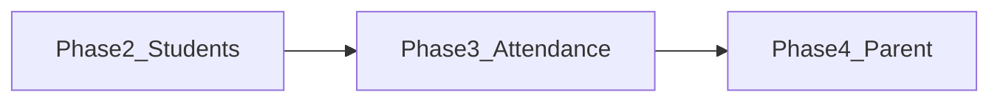

# Wave 3 orchestration — Lead Engineer delegation

**Status:** **Active** — Wave 2 is **complete**; this wave is the **current build**.

**Scope:** Product **Phases 2–4** in order (see [team_task_board.md](team_task_board.md)):

| Product phase | Focus | Owner agents (typical) |
|-----------------|--------|-------------------------|
| **Phase 2** | Students — directory, CRUD, minimal enrollment | Supabase / DB, Feature: Students, Auth & tenancy |
| **Phase 3** | Attendance — date-only sessions, P/A/L, idempotent marks, history/summary | Supabase / DB, Feature: Attendance |
| **Phase 4** | Parent — mobile shell, attendance summary/history, tenant isolation | Feature: Parent, Auth & tenancy |

**Authoritative context:** [team_task_board.md](team_task_board.md), [system_design.md](system_design.md), [INTEGRATIONS_AND_SETUP.md](INTEGRATIONS_AND_SETUP.md).

---

## Lead rules (same as prior waves)

1. **Single owner per migration file** — serialize edits to `supabase/migrations/*.sql` or split by migration number.  
2. **RLS + app together** — writes in the app require matching **INSERT/UPDATE/DELETE** policies (or `SECURITY DEFINER` RPCs); SELECT-only RLS is not enough for Phase 2–3.  
3. **One Flutter root** — [`schoolify_app/`](../schoolify_app/) only.  
4. **Stitch** — reference only under `Stitch UI/`; [branding.md](branding.md) for tokens.

---

## Dependency hint

Attendance depends on students (and usually enrollments) being meaningful; parent flows depend on attendance data existing with correct parent-scoped policies.

---

## Delegation template (per task)

1. **Current priority** (which product phase)  
2. **Agent**  
3. **Exact scope** (files/modules)  
4. **Dependencies**  
5. **Acceptance criteria**

---

## Review checklist (unchanged)

- [ ] [system_design.md](system_design.md) — layers, Riverpod, Supabase, `school_id`.  
- [ ] [rules.md](rules.md) — feature structure, file size, models, forms.  
- [ ] [branding.md](branding.md) — no ad-hoc visual drift.  
- [ ] No duplicated tenant or auth logic.  
- [ ] Stitch: reference only.

---

*Wave 3 replaces the old “Wave 3+” label in conversation — same locked plan, explicit active status.*
