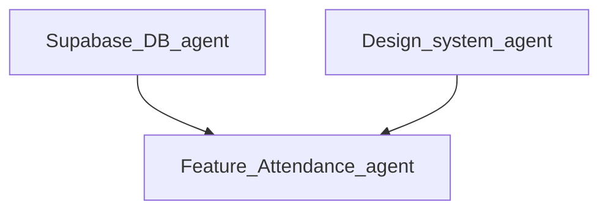

# Phase 3 — Attendance writes & mark flow (delegation + agent prompts)

**Status:** **Completed** (implemented: `004` + `005`, teacher mark flow + `upsert_attendance_mark`; see [wave3_status.md](wave3_status.md)).  
**Parent doc:** [wave3_delegation.md](wave3_delegation.md) · **Checklist:** [wave3_status.md](wave3_status.md).

**Product intent:** Date-only attendance, **idempotent** marks, P/A/L mapped to DB `present` / `absent` / **`late`** (see [`005_attendance_late_status.sql`](../supabase/migrations/005_attendance_late_status.sql); `excused` removed from check).

**Schema reference:** [`002_student_data.sql`](../supabase/migrations/002_student_data.sql) + [`004_attendance_writes.sql`](../supabase/migrations/004_attendance_writes.sql) + **`005`** (status enum).

---

## Lead decisions

1. **Single new migration file** — e.g. `supabase/migrations/004_attendance_writes.sql` — **only Supabase / DB agent** edits until merged.  
2. **Prefer RPC for upsert** — `SECURITY DEFINER` function that validates tenant + role + student belongs to `school_id`, then `INSERT ... ON CONFLICT ... DO UPDATE` (or equivalent) so marks are idempotent. Complement with RLS policies if direct table writes are also allowed.  
3. **Teacher vs admin** — Teachers may mark **school-wide roll for a date** (current app aggregates by school, not per-class row in DB); admins may override per policy. Align with existing [`teacher_attendance_repository`](../schoolify_app/lib/features/teacher/data/teacher_attendance_repository.dart) comments.  
4. **Flutter** — New/changed code lives under [`schoolify_app/lib/features/`](../schoolify_app/lib/features/) (feature modules + `core/` for shared types). No duplicate tenant logic outside `AuthRepository` / `schoolIdProvider`.

---

## Dependency graph



- **DB** must land (or be in review) before **Feature** merges calling new RPCs.  
- **Design system** only if new segmented controls / tables exceed existing primitives.

---

## Agent prompts (copy-paste)

### Agent 1 — Supabase / DB

**Priority:** P0  
**Scope:** `supabase/migrations/004_attendance_writes.sql` (new).

**Prompt:**

```text
You are the Supabase/DB agent for Schoolify. Read docs/system_design.md and supabase/migrations/002_student_data.sql.

Goal: Enable authenticated teachers (and optionally school admins) to INSERT/UPDATE attendance marks idempotently.

Requirements:
1. Add a UNIQUE constraint on public.attendance (school_id, student_id, date) so one row per student per calendar day per school. If the table already has duplicate rows in dev, document that a one-time cleanup may be needed before applying the constraint.
2. Implement either:
   (A) RLS policies for INSERT/UPDATE on public.attendance for users who are school_members of that school_id with role IN ('teacher','admin'), WITH CHECK that student_id belongs to a students row with the same school_id; OR
   (B) A SECURITY DEFINER RPC e.g. upsert_attendance_mark(school_id uuid, student_id uuid, p_date date, p_status text) that enforces the same checks and performs INSERT ... ON CONFLICT (school_id, student_id, date) DO UPDATE SET status = EXCLUDED.status, or equivalent.
   Prefer (B) or (B)+(minimal RLS) if RLS becomes too complex for FK validation.
3. Status must match existing check: 'present' | 'absent' | 'excused'.
4. Parents remain read-only on attendance unless product says otherwise; do not grant parent INSERT.
5. Grant EXECUTE on new RPCs to authenticated.

Deliver: one new migration file only. No Flutter. Note acceptance criteria in PR description.
```

**Acceptance:**

- [ ] `supabase db reset` (or equivalent) applies `001`–`004` cleanly.  
- [ ] Idempotent upsert: second call for same `(school_id, student_id, date)` updates `status`, does not duplicate.  
- [ ] Caller cannot mark a `student_id` from another school.

---

### Agent 2 — Feature: Attendance (Flutter)

**Priority:** P0 after Agent 1 merged or RPC names frozen.  
**Scope:** Repositories + teacher (and optionally admin) UI under `schoolify_app/lib/features/`.

**Prompt:**

```text
You are the Feature: Attendance agent. Stack: Flutter, Riverpod, Supabase — see docs/system_design.md (UI → Provider → Repository → Supabase).

Context: TeacherAttendanceScreen and TeacherAttendanceRepository currently only READ classes/students/attendance for "today". Phase 3 adds WRITE: mark attendance per student for a date with statuses present/absent/excused.

Tasks:
1. Add an abstract AttendanceRepository (or extend existing teacher attendance module) with methods such as:
   - listStudentsForSchoolRoll({required String schoolId, required DateTime date}) OR reuse existing student list patterns
   - upsertMark({required String schoolId, required String studentId, required DateTime date, required AttendanceStatus status})
   Stub implementation when !Env.hasSupabaseConfig (mirror students_repository pattern).
2. Supabase implementation calls the RPC from migration 004 (or direct table upsert if policies allow) with school_id from schoolIdProvider — never accept school_id from unvalidated user input without matching session tenant.
3. Update TeacherAttendanceScreen (or add a drill-in screen) so a teacher can:
   - Pick date (default today)
   - See student list with segmented control or chips for P/A/L (map to present/absent/excused)
   - Save marks; show loading/error via existing async patterns (asyncPageBody, etc.)
4. Keep files under ~300 lines per docs/rules.md; split widgets if needed.
5. Stitch UI/: reference only for layout; use docs/branding.md for tokens.

Deliver: flutter analyze clean; no service_role; no duplicate auth/tenant logic (use schoolIdProvider + AuthRepository patterns).
```

**Acceptance:**

- [ ] Mark flow works against Supabase with `--dart-define` when migration `004` is applied.  
- [ ] Offline/stub path still works without Supabase config.  
- [ ] Idempotent behavior visible (re-toggling same day updates, no duplicate key errors).

---

### Agent 3 — Auth & tenancy (supporting)

**Priority:** P1 — only if RPC needs JWT claims beyond `auth.uid()`.  
**Scope:** `schoolify_app/lib/core/auth/**`, `core/tenancy/**`.

**Prompt:**

```text
You are the Auth & tenancy agent. Phase 3 attendance RPCs use auth.uid() and school_id passed from the client.

Verify: schoolIdProvider and AuthSession.schoolId stay the single source of truth; repositories use the same school_id the user is a member of. If get_my_school_id() returns one school for MVP, document that multi-school users must switch context later.

No schema changes unless coordinated with Supabase agent.
```

**Acceptance:**

- [ ] No second copy of membership resolution in feature code.

---

### Agent 4 — Design system (optional)

**Priority:** P2  
**Scope:** `schoolify_app/lib/core/ui/**`

**Prompt:**

```text
You are the Design system agent. Reuse SchoolifyButton, SchoolifyChip, SchoolifyCard, theme from core/theme per docs/branding.md.

Only add a new primitive if the mark-attendance segmented control cannot be built from existing widgets. Keep accessibility (large tap targets).
```

**Acceptance:**

- [ ] No new colors outside branding tokens without product approval.

---

### Agent 5 — Platform / docs

**Priority:** P2  
**Scope:** `docs/INTEGRATIONS_AND_SETUP.md`, `schoolify_app/README.md`, [wave3_status.md](wave3_status.md).

**Prompt:**

```text
You are the Platform agent. After 004 merges, document how to run migrations locally and mention the new attendance RPC name + parameters. Update wave3_status.md checkboxes for Phase 3 RLS + Flutter rows.
```

**Acceptance:**

- [ ] New developer can apply migrations and test mark flow from README path.

---

## Parallelization

| Parallel OK | Serialize |
|-------------|-----------|
| Agent 4 (design review) while Agent 1 drafts SQL | Agent 2 merges RPC calls **after** RPC names/signatures are in `004` |
| Agent 5 doc stubs | Agent 1 + Agent 2 must not both own the same Dart + SQL file |

---

## Review checklist

- [ ] [system_design.md](system_design.md) — Riverpod, repository boundary, `school_id`.  
- [ ] [rules.md](rules.md) — file size, feature folders.  
- [ ] [branding.md](branding.md) — UI tokens.  
- [ ] [wave3_status.md](wave3_status.md) — Phase 3 rows updated when done.

---

*Lead Engineer: assign owners in your tracker; merge order = migration `004` → Flutter attendance feature → docs.*
