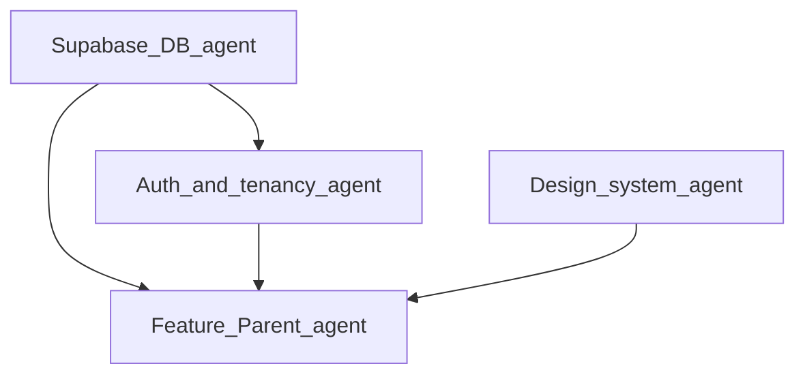

# Phase 4 — Parent shell, attendance summary, parent↔student linkage (delegation + agent prompts)

**Status:** **Ready to execute** (depends on Phase 3 attendance data + `upsert_attendance_mark`; optional hard dependency on Phase 2 student rows).  
**Parent doc:** [wave3_delegation.md](wave3_delegation.md) · **Checklist:** [wave3_status.md](wave3_status.md).

**Product intent:** Parents see **only their own children’s** data in a school; **attendance summary/history** and dashboard copy reflect the **selected child**; **tenant isolation** enforced in Postgres (RLS), not only in Flutter filters.

**Current gap (codebase):** Parent repositories use **`students` `.limit(1)`** (first student in school) — wrong for multi-child and **not** a real linkage. Example: [`parent_attendance_repository.dart`](../schoolify_app/lib/features/parent/data/parent_attendance_repository.dart), [`parent_dashboard_repository.dart`](../schoolify_app/lib/features/parent/data/parent_dashboard_repository.dart).

---

## Lead decisions

1. **New migration(s)** — e.g. `006_parent_student_linkage.sql` — **only Supabase / DB agent** owns the file until merged.  
2. **Explicit linkage table** — e.g. `student_parents` (`school_id`, `student_id`, `parent_user_id`, `created_at`, PK/unique on `(student_id, parent_user_id)`). Alternative names: `guardians`, `student_guardians` — pick one; document in PR.  
3. **RLS** — Parents (`school_members.role = 'parent'`) may **SELECT** rows only where `student_id` appears in linkage for `auth.uid()`. Teachers/admins retain existing broader school policies where applicable.  
4. **No trust-the-client** — Do not pass arbitrary `student_id` from UI without verifying linkage server-side (RLS or RPC).  
5. **Flutter** — Introduce a **selected child** (or `studentId`) in Riverpod, sourced from linkage query; replace `.limit(1)` hacks.  
6. **Stitch** — Reference only; [branding.md](branding.md) for tokens.

---

## Dependency graph



- **DB** first: linkage + policies; then **Auth** can expose “my children ids”; then **Parent feature** wires UI.

---

## Agent prompts (copy-paste)

### Agent 1 — Supabase / DB

**Priority:** P0  
**Scope:** New migration `supabase/migrations/006_parent_student_linkage.sql` (number may bump if `006` exists — use next free).

**Prompt:**

```text
You are the Supabase/DB agent for Schoolify. Read docs/system_design.md, supabase/migrations/001_baseline.sql, 002_student_data.sql, and 004/005 attendance migrations.

Goal: Model parent↔student relationship per school and enforce RLS so parents only read attendance/students linked to them.

Requirements:
1. Create table public.student_parents (or agreed name) with:
   - school_id uuid NOT NULL REFERENCES schools(id) ON DELETE CASCADE
   - student_id uuid NOT NULL REFERENCES students(id) ON DELETE CASCADE
   - parent_user_id uuid NOT NULL REFERENCES profiles(id) ON DELETE CASCADE
   - created_at timestamptz DEFAULT now()
   - UNIQUE (student_id, parent_user_id); index on (parent_user_id, school_id)
2. Enable RLS. SELECT policy: authenticated may read rows where parent_user_id = auth.uid() OR where caller is admin/teacher of that school (define minimally — teachers may need to manage linkage later).
3. INSERT/UPDATE/DELETE: start with admin-only (same pattern as student writes in 003) OR SECURITY DEFINER RPC add_parent_link(school_id, student_id, parent_user_id) for admins.
4. Update or add policies on public.students and public.attendance for role=parent:
   - Parent can SELECT students rows only if a student_parents row exists for (student_id, auth.uid()).
   - Parent can SELECT attendance rows only for those students (and matching school_id).
   - Do not grant parent INSERT on attendance (writes stay teacher/admin via upsert_attendance_mark).
5. Document how to seed a link in dev (SQL snippet in PR or docs).

Deliver: one migration file; no Flutter.
```

**Acceptance:**

- [ ] Parent test user sees **only** linked students; cannot SELECT another student in same school by id guessing (verify with two students).  
- [ ] Teacher/admin can still use existing flows.  
- [ ] `supabase db reset` applies full chain.

---

### Agent 2 — Auth & tenancy

**Priority:** P0 after Agent 1  
**Scope:** `schoolify_app/lib/core/auth/**`, `core/tenancy/**`, optional `features/parent/`.

**Prompt:**

```text
You are the Auth & tenancy agent. After student_parents exists:

1. Add a provider or repository method: listLinkedStudentIds({required String schoolId}) or Stream/List of StudentRef for the current user when role is parent.
2. Add selectedStudentIdProvider (StateProvider or Notifier) persisted in memory for session; default to first linked child.
3. Ensure schoolIdProvider remains the tenant root; student scope is secondary.

No duplicate membership logic; use auth.uid() + Supabase reads only.
```

**Acceptance:**

- [ ] Parent session resolves 0..n children; empty state UX can be delegated to Feature agent.

---

### Agent 3 — Feature: Parent (Flutter)

**Priority:** P0 after Agent 2  
**Scope:** `schoolify_app/lib/features/parent/**`

**Prompt:**

```text
You are the Feature: Parent agent. Stack: Flutter, Riverpod, Supabase (docs/system_design.md).

Tasks:
1. Replace all "first student in school" (.limit(1)) patterns with queries filtered by selectedStudentIdProvider (or linkage list).
2. Add UI: child switcher (DropdownButton, segmented control, or bottom sheet) when len(children) > 1; hide when one child.
3. Update ParentDashboardScreen, ParentAttendanceScreen, and repositories to pass explicit student_id from selection.
4. Map attendance status labels for present/absent/late consistently with teacher UI (005 migration uses 'late').
5. Stub repositories when !Env.hasSupabaseConfig.
6. Keep files <300 lines; split widgets.

Stitch UI/: layout reference only. branding.md for colors/type.
```

**Acceptance:**

- [ ] Multi-child parent sees correct per-child attendance and dashboard.  
- [ ] `flutter analyze` clean.

---

### Agent 4 — Design system (optional)

**Priority:** P2  
**Scope:** `schoolify_app/lib/core/ui/**`

**Prompt:**

```text
You are the Design system agent. Implement child switcher using existing SchoolifyChip / AppCard / theme tokens per branding.md. Mobile-friendly tap targets for parent flows.
```

**Acceptance:**

- [ ] No orphan colors; reuse theme extensions.

---

### Agent 5 — Platform / docs

**Priority:** P2  
**Scope:** `docs/INTEGRATIONS_AND_SETUP.md`, [wave3_status.md](wave3_status.md), [schoolify_app/README.md](../schoolify_app/README.md).

**Prompt:**

```text
You are the Platform agent. Document migration 006 (linkage), how to seed parent+student+link for manual QA, and update wave3_status.md Phase 4 rows when features merge.
```

**Acceptance:**

- [ ] New developer can run parent multi-child scenario locally.

---

## Parallelization

| Parallel OK | Serialize |
|-------------|-----------|
| Agent 4 prototyping UI with mock child list | Agent 3 **must** use real linkage after DB merges |
| Agent 5 doc outline | Agent 1 migration before Agent 2–3 production wiring |

---

## Review checklist

- [ ] [system_design.md](system_design.md) — Provider → Repository → Supabase; `school_id` on tenant tables.  
- [ ] [rules.md](rules.md) — feature modules, file size.  
- [ ] [branding.md](branding.md).  
- [ ] [wave3_status.md](wave3_status.md) — Phase 4 checkboxes updated when done.  
- [ ] No `service_role` in Flutter.

---

## Risks before Phase 4 (Lead)

| Risk | Mitigation |
|------|------------|
| **RLS regression** for teachers/admins | Test migrations with all three roles after `006`. |
| **`get_my_school_id` + multi-school** | MVP assumes one active school; document if parent has children in multiple schools later. |
| **Enrollment (class roster)** | Out of scope for Phase 4 unless product ties parent visibility to class enrollment — flag with PM. |

---

*Lead Engineer: merge order = linkage migration → auth providers → parent feature → docs.*
