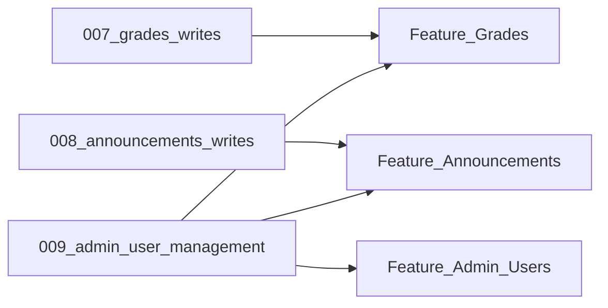

# Wave 4 implementation plan

**Goal:** Deliver post-Wave-3 features now in scope:

1. Grades write flow
2. Announcements end-to-end
3. Admin user management

**Explicitly out of scope:** Fees/payments and Stripe integration in this wave.

**Baseline assumptions from current repo:**

- `grade_items` and `announcements` already exist in [`supabase/migrations/002_student_data.sql`](../supabase/migrations/002_student_data.sql).
- Parent linkage RPC `add_parent_link` exists in [`supabase/migrations/006_parent_student_linkage.sql`](../supabase/migrations/006_parent_student_linkage.sql).
- Repository pattern is standardized: abstract interface -> `Stub*` -> `Supabase*` -> provider gated by `Env.hasSupabaseConfig`.
- Roles are admin/teacher/parent with role-based shells in [`schoolify_app/lib/app/router.dart`](../schoolify_app/lib/app/router.dart).

---

## Current state snapshot (for planning)

- **Grades:** read-only lists exist for teacher/parent in:
  - [`schoolify_app/lib/features/teacher/data/teacher_grades_repository.dart`](../schoolify_app/lib/features/teacher/data/teacher_grades_repository.dart)
  - [`schoolify_app/lib/features/parent/data/parent_grades_repository.dart`](../schoolify_app/lib/features/parent/data/parent_grades_repository.dart)
  - No write APIs/UI yet.
- **Announcements:** shared repository is stub-only in:
  - [`schoolify_app/lib/features/announcements/data/announcements_repository.dart`](../schoolify_app/lib/features/announcements/data/announcements_repository.dart)
  - Teacher/parent screens only render list views.
- **Admin user management:** no dedicated feature module yet; admin shell has dashboard/students/messages placeholder only:
  - [`schoolify_app/lib/features/admin/presentation/admin_shell.dart`](../schoolify_app/lib/features/admin/presentation/admin_shell.dart)
  - [`schoolify_app/lib/features/admin/presentation/admin_messages_placeholder_screen.dart`](../schoolify_app/lib/features/admin/presentation/admin_messages_placeholder_screen.dart)

---

## Wave 4 scope and ownership

| Track | Primary owner agent | Supporting agents |
|------|----------------------|-------------------|
| Grades write flow | Feature: Grades | Supabase/DB, Auth & tenancy, Platform |
| Announcements end-to-end | Feature: Announcements | Supabase/DB, Platform, Design system |
| Admin user management | Feature: Admin | Supabase/DB, Auth & tenancy, Parent feature |

---

## Track A — Grades write flow

### DB changes

Create one migration (name can shift to next free number), e.g.:

- `supabase/migrations/007_grades_writes.sql`

Planned SQL scope:

- Add write path for `grade_items`:
  - Teacher/admin write access in-tenant.
  - Parent remains read-only.
- Prefer `SECURITY DEFINER` RPCs for controlled writes:
  - `upsert_grade_item(...)`
  - optional `delete_grade_item(...)`
- Keep status/format compatible with current model (`course_label`, `assignment_label`, `score_label`) unless product requests schema expansion.

### Flutter files

Modify:

- [`schoolify_app/lib/features/teacher/data/teacher_grades_repository.dart`](../schoolify_app/lib/features/teacher/data/teacher_grades_repository.dart)
  - Add write methods to abstract/stub/supabase implementations.
- [`schoolify_app/lib/features/teacher/presentation/teacher_grades_screen.dart`](../schoolify_app/lib/features/teacher/presentation/teacher_grades_screen.dart)
  - Add create/edit/delete actions.
- [`schoolify_app/lib/features/parent/data/parent_grades_repository.dart`](../schoolify_app/lib/features/parent/data/parent_grades_repository.dart)
  - Keep read-only; confirm selected student behavior stays scoped.

Create (recommended):

- `schoolify_app/lib/features/teacher/presentation/grade_editor_sheet.dart`
- `schoolify_app/lib/features/teacher/presentation/grade_delete_dialog.dart` (or inline dialog if small)

### Acceptance criteria

- Teacher can create and edit a grade item for linked students in own school.
- Parent sees grade updates for selected linked child without cross-student leakage.
- Unauthorized roles cannot write grades.
- Stub mode still works with `Env.hasSupabaseConfig == false`.

---

## Track B — Announcements end-to-end

### DB changes

Create one migration, e.g.:

- `supabase/migrations/008_announcements_writes.sql`

Planned SQL scope:

- Add write policies and/or RPCs for `announcements`:
  - Admin and optionally teacher can create/edit/delete school announcements.
  - Parent read-only.
- Keep tenant isolation by `school_id`.

### Flutter files

Modify:

- [`schoolify_app/lib/features/announcements/data/announcements_repository.dart`](../schoolify_app/lib/features/announcements/data/announcements_repository.dart)
  - Add `SupabaseAnnouncementsRepository`; keep stub path.
- [`schoolify_app/lib/features/teacher/presentation/teacher_announcements_screen.dart`](../schoolify_app/lib/features/teacher/presentation/teacher_announcements_screen.dart)
  - Add write UI if teacher is allowed by product decision.
- [`schoolify_app/lib/features/parent/presentation/parent_announcements_screen.dart`](../schoolify_app/lib/features/parent/presentation/parent_announcements_screen.dart)
  - Ensure read-only UX.
- [`schoolify_app/lib/features/teacher/data/teacher_dashboard_repository.dart`](../schoolify_app/lib/features/teacher/data/teacher_dashboard_repository.dart)
  - Confirm summary count reflects real Supabase announcements after writes.

Create (recommended):

- `schoolify_app/lib/features/admin/data/admin_announcements_repository.dart`
- `schoolify_app/lib/features/admin/presentation/admin_announcements_screen.dart`
- `schoolify_app/lib/features/admin/presentation/announcement_editor_sheet.dart`

Router/shell updates:

- [`schoolify_app/lib/app/router.dart`](../schoolify_app/lib/app/router.dart)
- [`schoolify_app/lib/features/admin/presentation/admin_shell.dart`](../schoolify_app/lib/features/admin/presentation/admin_shell.dart)

### Acceptance criteria

- Admin can post announcement; teacher/parent see it in their existing announcement screens.
- Updates/deletes propagate correctly and remain tenant-scoped.
- Stub data path still works offline.

---

## Track C — Admin user management

### DB changes

Create one migration, e.g.:

- `supabase/migrations/009_admin_user_management.sql`

Planned SQL scope:

- School member management APIs (admin-only), likely via RPCs:
  - list members (join `school_members` + `profiles`)
  - add member by existing profile id
  - update member role
  - remove member
- Reuse/align with existing `add_parent_link` in [`006_parent_student_linkage.sql`](../supabase/migrations/006_parent_student_linkage.sql) for parent-child linking workflows.
- Keep parent read scopes intact from migration `006`.

### Flutter files

Create:

- `schoolify_app/lib/features/admin/data/admin_members_repository.dart`
- `schoolify_app/lib/features/admin/presentation/admin_users_screen.dart`
- `schoolify_app/lib/features/admin/presentation/admin_member_editor_sheet.dart`
- `schoolify_app/lib/features/admin/presentation/admin_parent_links_screen.dart` (if parent linking is handled from admin UI)

Modify:

- [`schoolify_app/lib/app/router.dart`](../schoolify_app/lib/app/router.dart)
  - Add route branch for user management.
- [`schoolify_app/lib/features/admin/presentation/admin_shell.dart`](../schoolify_app/lib/features/admin/presentation/admin_shell.dart)
  - Add nav destination for Users/People (and optional Announcements destination if included).
- [`schoolify_app/lib/features/admin/presentation/admin_dashboard_screen.dart`](../schoolify_app/lib/features/admin/presentation/admin_dashboard_screen.dart)
  - Optional summary cards for counts by role.

### Acceptance criteria

- Admin can list school members and change role safely.
- Admin can link parent to student using `add_parent_link` flow.
- Non-admin roles cannot access admin management routes/actions.
- Parent-facing data remains limited to linked students.

---

## Dependencies and sequencing

Recommended merge order:

1. DB migrations (`007`, `008`, `009`) in separate PRs (serialized per migration file ownership).
2. Feature repos and providers for each track.
3. UI/screens and router wiring.
4. Docs/test-plan updates.

---

## Detailed delegation map (who does what)

### Supabase / DB agent

- Owns `supabase/migrations/007_*.sql`, `008_*.sql`, `009_*.sql`.
- Provides RPC contracts first so Flutter agents can code against stable signatures.

### Feature: Grades agent

- Owns teacher/parent grades repositories and teacher grade write UI.

### Feature: Announcements agent

- Owns announcements repository evolution and admin/teacher announcement CRUD UI.

### Feature: Admin agent

- Owns admin user management feature module, screens, and route branches.

### Auth & tenancy agent

- Verifies role/tenant guardrails and no duplicate membership logic.

### Platform agent

- Updates docs (`README`, integrations/testing steps), verifies runbook.

---

## Out of scope for Wave 4

- Fees module enhancements beyond current placeholders.
- Stripe checkout/billing portal/webhooks and payment flows.
- Push notifications (OneSignal via Supabase Edge Functions), advanced realtime messaging, and grading analytics.
- Multi-school active-context switching UX (beyond existing `get_my_school_id()` assumptions).

---

## Done definition for Wave 4

- All three in-scope tracks shipped behind role-safe routes.
- Corresponding migrations applied and validated against RLS constraints.
- `flutter analyze` and smoke tests pass for stub mode and Supabase mode.
- `docs/wave3_status.md` (or successor status doc) updated to reflect new shipped scope.

