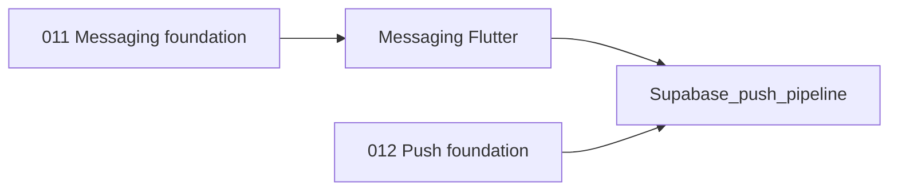

# Wave 5 implementation plan

**Goal:** Deliver the deferred communication infrastructure after Waves 1-4:

1. Messaging between staff and parents
2. Push notifications (Supabase push via Edge Functions)

**Scope change note:** Fees/payments are intentionally removed from Wave 5 and deferred to a future wave until payment strategy is decided (Stripe + local payment method).

**Baseline assumptions from current repo:**

- Waves 1-4 are complete; migrations `001`-`010` are treated as applied.
- App architecture remains locked: Flutter + Riverpod + Supabase with role and tenant isolation.
- Repositories follow the established contract pattern: abstract -> `Stub*` -> `Supabase*` -> provider gated by `Env.hasSupabaseConfig`.
- Existing placeholder:
  - [`schoolify_app/lib/features/admin/presentation/admin_messages_placeholder_screen.dart`](../schoolify_app/lib/features/admin/presentation/admin_messages_placeholder_screen.dart)
- Supabase Pro is available (Edge Functions + Realtime are in-scope).

---

## Wave 5 scope and ownership

| Track | Primary owner agent | Supporting agents |
|------|----------------------|-------------------|
| Messaging | Feature: Messaging | Supabase/DB, Platform, Design system |
| Push notifications (Supabase push) | Platform/Mobile infra | Supabase/DB, Feature agents, Auth & tenancy |

---

## Current state snapshot (for planning)

- **Messaging (Track C):** **shipped** — migrations `015` + `016` applied, admin/teacher/parent message tabs wired, teacher participant-source fix completed.
- **Push (Track B):** no notification token/storage/service modules yet.
- **Announcements/attendance/grades:** already produce user-facing events that can become push triggers once notification plumbing exists.

---

## Lead decisions (locked for Wave 5)

1. **Issue 1 (teacher participant source):** must be fixed in Track C before messaging sign-off (teachers cannot depend on admin-only member lookup RPCs for thread creation).
2. **Issue 2 (notification_events persistence):** explicitly deferred to Track B (push implementation), not a Track C blocker.
3. **Issue 3 (strict staff↔parent participant enforcement):** intentionally left open pending product decision; do **not** reopen or block Wave 5 Track C on this question.

---

## Track C — Messaging between staff and parents

**Status:** **Shipped** (subject to standard regression checks).

### What needs to be built

#### C1) Messaging data model (Supabase/DB owner)

Create migration:

- `011_messaging_foundation.sql`

Planned schema:

- `message_threads`
  - `id`, `school_id`, `subject`, `created_by`, `created_at`
- `thread_participants`
  - `thread_id`, `user_id`, `role`, `joined_at`
- `thread_messages`
  - `id`, `thread_id`, `sender_id`, `body`, `created_at`
- `thread_reads` (optional MVP+)
  - per-user read cursors (`last_read_message_id`, `read_at`)

RLS:

- User can read/write only threads where they are participant.
- Admin/teacher can create threads with linked parents in same school.
- Parent cannot access unrelated threads in same school.

Realtime:

- Enable Realtime for `thread_messages` and optionally `thread_reads`.

#### C2) Flutter feature modules (Feature: Messaging owner)

Create:

- `schoolify_app/lib/features/messaging/data/messaging_repository.dart`
- `schoolify_app/lib/features/messaging/domain/*` models (`ThreadSummary`, `ThreadMessage`, `Participant`)
- `schoolify_app/lib/features/messaging/presentation/messages_list_screen.dart`
- `schoolify_app/lib/features/messaging/presentation/thread_screen.dart`
- `schoolify_app/lib/features/messaging/presentation/new_message_sheet.dart`

Role entry points:

- Replace admin placeholder:
  - [`schoolify_app/lib/features/admin/presentation/admin_messages_placeholder_screen.dart`](../schoolify_app/lib/features/admin/presentation/admin_messages_placeholder_screen.dart)
- Add teacher and parent message routes/branches in [`schoolify_app/lib/app/router.dart`](../schoolify_app/lib/app/router.dart) and respective shells.

Repository behavior:

- `StubMessagingRepository` for offline/dev.
- `SupabaseMessagingRepository` with paginated list and realtime stream/refresh.

#### C3) Notification linkage contract (Messaging + Platform owners)

- On message insert, create `notification_events` records for recipients (excluding sender).
- Keep this contract stable so Track B can plug in without reworking messaging APIs.

### Acceptance criteria

- Staff and parents can create and reply in role-allowed threads.
- Cross-tenant and non-participant access is blocked by RLS.
- New messages appear live (Realtime) or refresh quickly with fallback polling.
- Message send events are persisted as notification events for push processing (**deferred to Track B by lead decision lock; non-blocking for Track C sign-off**).

---

## Track B — Push notifications (Supabase push)

**Platform scope lock:** Track B is **mobile-only** for Wave 5 (**iOS + Android**).  
**Explicitly out of scope in this track:** web push (service worker/VAPID).

### What needs to be built

#### B1) Database and token model (Supabase/DB owner)

Create migration:

- `012_push_notifications_foundation.sql`

Planned schema:

- `device_push_tokens`
  - `id`, `user_id`, `school_id`, `platform`, `token`, `last_seen_at`, unique token
- `notification_events`
  - normalized event payloads (`type`, `school_id`, `target_user_id`, `entity_id`, `title`, `body`)
- `notification_deliveries`
  - delivery log (`event_id`, `token_id`, `status`, provider response, timestamps)

RLS:

- Users can manage their own tokens only.
- App users do not directly write delivery logs (service role/Edge only).

#### B2) Supabase push send pipeline (Platform owner)

Build/extend Edge Function:

- `send_push_notifications`
  - reads `notification_events`, resolves `device_tokens`, and sends notifications from a Supabase Edge Function (provider-agnostic transport, no external push SDK dependency in app layer).

Event producers (initial):

- New message created (Track C, required)
- New announcement posted/edited (Wave 4 extension)
- New attendance mark created/updated (Phase 3 extension)

#### B3) Flutter app integration (Platform owner)

Packages and setup:

- Use `supabase_flutter` only for app-side token registration and event reads.
- No separate client push package setup is required for this project plan.

Create:

- `schoolify_app/lib/core/notifications/push_notification_service.dart`
- `schoolify_app/lib/core/notifications/push_token_repository.dart`
- `schoolify_app/lib/core/notifications/push_notification_providers.dart`

Wire initialization:

- `main.dart` / bootstrap initialization and foreground handler registration.
- token registration/refresh tied to authenticated user and active school context.

### Acceptance criteria

- Authenticated users register/update push token successfully.
- Triggered events create notification records and produce Supabase push send attempts.
- Foreground and background notification behavior works on at least one iOS and one Android device.
- Token cleanup exists for invalid/unregistered tokens.

---

## Dependencies and sequencing

Recommended execution order:

1. Track C messaging DB (`011`) + core messaging UI/repository first.
2. Track B push DB (`012`) + Supabase push infrastructure second.
3. Connect push event producers from messaging first, then announcements/attendance.
4. Final integration QA across roles/devices.

---

## Detailed delegation map

### Supabase / DB agent

- Own migrations for messaging and push only (`011`-`012` in this wave).
- Define RPC signatures and RLS contracts first.
- Provide SQL seed snippets for local QA scenarios.

### Feature: Messaging agent

- Own message repositories, models, and thread/list UIs for admin/teacher/parent.
- Integrate Realtime subscriptions.

### Platform / Mobile infra agent

- Own Supabase push setup and notification infrastructure.
- Own Edge Function deployment docs and environment setup.

### Auth & tenancy agent

- Validate role guards, tenant propagation (`school_id`), and linkage reuse.
- Ensure no duplicate membership/tenant resolution logic.

### Design system agent

- Keep new screens aligned with existing UI primitives and branding tokens.

---

## Risks and mitigations

| Risk | Mitigation |
|------|------------|
| Token spam / stale device tokens | Add token freshness timestamps and invalid-token cleanup process. |
| Messaging RLS regressions | Build role-matrix SQL tests (admin/teacher/parent in same and different schools). |
| Feature overlap in router/shells | Serialize ownership for `router.dart` and each shell file. |
| Push implementation before message schema stabilizes | Keep execution order strict: messaging first, then push wiring. |

---

## Explicitly out of scope for Wave 5

- Fees/payments and payment-provider implementation (Stripe/local payment method decision pending).
- Full accounting/ledger exports and tax reporting.
- Web push (VAPID/service-worker path) unless separately approved.
- Rich media messaging (attachments, voice notes, moderation pipeline).
- Advanced notification preferences center (per-channel granular controls).

---

## Done definition for Wave 5

- Messaging track: role-safe threads/messages shipped for admin, teacher, and parent.
- Push track: `device_tokens` stored and Supabase Edge Function delivery pipeline operational for at least message and announcement/attendance events.
- Messaging-first sequencing respected (push implemented only after messaging data model/repositories are in place).
- Migrations and Edge Functions documented and repeatable for messaging and push.
- `flutter analyze` and role-based smoke tests pass in Supabase-backed mode and stub mode.
